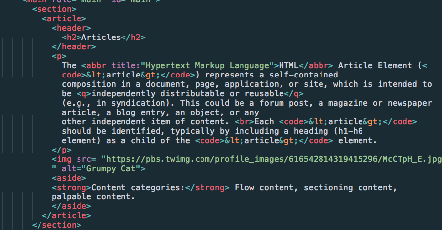
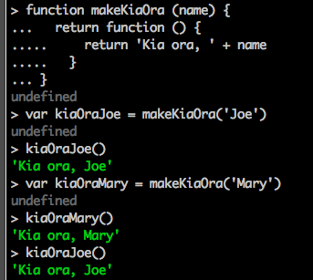

# Review

On the HTML, you're clearly understanding the purpose and use of semantic HTML. Very nice!

Some minor touch up on style, however. One thing is no spaces around the `=`:

```html
<nav role="navigation" id = "global-nav">
```

Role is right; id is wrong. This is just a matter of practice. In most other languages, you *do* want the space. But that's programming. Don't get accustomed to one particular way because you'll find that it changes from language to language, job to job, and company to company, not to mention over time! Flexibility and adaptability are the keys to success in the whirlwind world of the World Wide Web!

On your CSS, prefer this:

```css
p {
  color: #112654;
  font-family: "helvetica", sans-serif;
}
```

To this:

```css
p
{
  color: #112654;
  font-family: "helvetica", sans-serif;
}
```

Again, if you did some programming and learned from someone old school (like me), then you might have been told to line up those braces. But this is by far not the preferred style for CSS. If you do it this way it will work fine, but you will irritate every other developer who has to work with your code. It's just not worth it.

It's a tricky thing to know when to adhere strictly to the most common way and when to embrace the new, and it just takes experience and lots of trial and error to figure out something workable. For now, we're setting the style guide.

Your header on line 34 could use a `role="banner"` role. Otherwise, the roles look good.

Whoops. Watch out for this:

```html
<abbr title:"Hypertext Markup Language">
```

It's `=`, not `:`. Did you use the [HTML validator](https://validator.w3.org/#validate_by_input)? I'm guessing not. ALWAYS use the validator. Every time. Check all your HTML. All your CSS. All your JavaScript. It's free. Why wing it? We all make mistakes. The validators and lints are there to help you. It's not cheating; it's just smart.

Also, watch your line lengths. Shoot for 80 characters. This is what your HTML looks like in my text editor:



See the vertical line to the right? That's the 80-character mark. If you broke your lines there, the code would be very clean and readable. Instead, it's wrapping and ugly.

Otherwise, superb.

Nice work on the usability and accessibility stuff. Good to know that if there are 15 guys in a room, odds are that at least one has red-green color blindness. Probably not good to rely on red-green color alone for important information!

And you won't get any disagreement from me re responsive design. Why do double (or triple or quadruple) the work when you can do 20% more and make your website do it all. And then you have a single source of truth, too. But sometimes there is a need for something you can only get by going native. Less often than you'd expect, though.

Good work on the product objectives and user needs. Sounds like a site that you have personal interest in.

On the JavaScript, did you see that we're using the [standard.js]() style guide? Please review the rules carefully and make sure you follow them. It's just about layout mostly.

So, for example, your first function (which is perfect algorithmically) would be easier to read like this:

```js
function cube (x) {
  return (x * x * x)
}
```

On the functions that you tested in the REPL, please remove the . . . from the front of the lines so that they are the correct code. (The . . . is how the REPL indicates "continued from the previous line". It's not part of the code.)

So your second function should look like this:

```js
function absolute (x) {
  if (x>0) {
    return (x)
  } else {
    return (x*-1)
  }
}
```

If we follow the standard.js style guide, we'd get this. Also, note that you're multiplying 0 * -1. No need to do that. Invert the conditional, and it's easy to avoid. Also, it puts the condition we're correcting up front and center. Also, the `-` is the negation operator. We can simply prefix `x` with it to negate the value of `x`. Finally, parentheses are for grouping. They make no sense if there's only the `x` in them!

```js
function absolute (x) {
  if (x < 0) {
    return -x
  } else {
    return x
  }
}
```

Cleaner, eh? Also, remember that `return` ends the function immediately, so as soon as one `return` happens, any others are ignored. So we can also do this:

```js
function absolute (x) {
  if (x < 0) return -x

  return x
}
```

A wee bit cleaner, no?

The names bit works, but I was hoping for use of the `map` function. Does the following make sense to you? If not, ping me on Slack.

```js
function addY (name) {
  return name + 'y'
}

var names = ['Bill', 'Carl', 'Kat', 'Emil', 'Cath']

console.log(names.map(addY))
```

Clever choice of names, by the way.

Deliverable #4, however, is not what we were looking for at all. What we want is a `makeKiaOra` function that returns a *function* that when called with *nothing* returns "Kia ora, Joe" (assumign that `makeKiaOra` was called with the name, "Joe").

So the function it *returns* must look like this:

```js
function () {
  return 'Kia ora, ' + name
}
```

As you can see, `name` is undefined here. That's because we're going to pass it in using the outer function:

```js
function makeKiaOra (name) {
  return function () {
    return 'Kia ora, ' + name
  }
}
```

Now if we call it with "Joe", then we get a function that, when called, returns "Kia ora, Joe" and if we call it with Mary, we get a *function* that, when called, returns "Kia ora, Mary".



Nice try on the extra credit! It's not easy.

One thing to remember is that `return` *ends the function call*. So if we call `return`, there is generally no point to putting any code after it. (Note that in the example with two returns above, the first return is only called when x < 0, so the second return does sometimes get called). In this function, the code after the return will *never* be called, so it serves no purpose. Return ends the function call! Good to remember.

```js
function makeSince(d) {
  return (new Date() - since);
  since = since + makeSince;
}
```

Now the other thing is that you need to read the instructions carefully. They're tricky! That puts the "extra" in extra credit. :-) The instructions say that the `makeSince` function *returns a FUNCTION.

So you're going to have something like this:

```js
function makeSince (d) {
  return function () {
    return // what goes here?
  }
}
```

And what does the inner function return? Well it returns the time between time `d` and the time it is called. Where does `d` come from? It comes from the call to `makeSince`.

So `makeSince` is a function *that makes a `since` function*. And it sets it with a default time (Date).

When we call the inner function, we want it to give us the *difference* (in seconds) between `d` and the time right now, where now is when we call the inner function.

This requires you to be clear on the difference between *defining* a function, and *calling it*. We *define* the function when we decide how it works and what it does:

```js
function sayHi () {
  console.log('Hi!')
}
```

When I run this code, I do NOT see "Hi!" in the console. That's because I'm not *running* (calling) the function, I'm just defining it. I'm saying to my application, "When I call `sayHi()` I want you to print 'Hi!' to the console." I'm NOT saying "Do it now".

When I call the code, *then* it performs the action:

```js
sayHi() // prints Hi! to the console. Try it.
```

BIG difference. So if I can calculate the difference between two datetimes by subtracting:

```js
new Date() - d
```

(Where `d` is the date we passed in.) And this returns milliseconds, so I can get seconds by dividing by 1000:

```js
(new Date() - d) / 1000
```

So let's try this:

```js
function makeSince (d) {
  return function () {
    return (new Date() - d) / 1000
  }
}
```

This *defines* the `makeSince` function, but NOT the inner function (not yet). The inner fuction is defined *and returned* when the `makeSince` function is called. So if I call the `makeSince` function with the current time (new Date()) and assign the function that is returned to a variable (let's call it `since`, :-) then I can now call that `since` function which was defined when I called `makeSince`. When I call it, I'll get the number of seconds since `d`.

```js
var since = makeSince(new Date())
```

Try it!

What if instead of passing in the date, I just wanted to capture the time since the since function was created. Well, I could just do this:

```js
function makeSince () {
  var d = new Date()

  return function () {
    return (new Date() - d) / 1000
  }
}
```

Now I call it like this:

```js
var since = makeSince()
```

And I get the time since the `since` function was defined. Each time I call `since` I should get a larger number since it has been longer since I defined it. I "captured" the time at which it was defined, and I can keep calculating that difference.

Does this make sense? If so, you've grasped a fairly advanced JavaScript (programming) concept. Congratulations! If not, don't worry. You'll have plenty of time to get comfortable with these sorts of functions.
